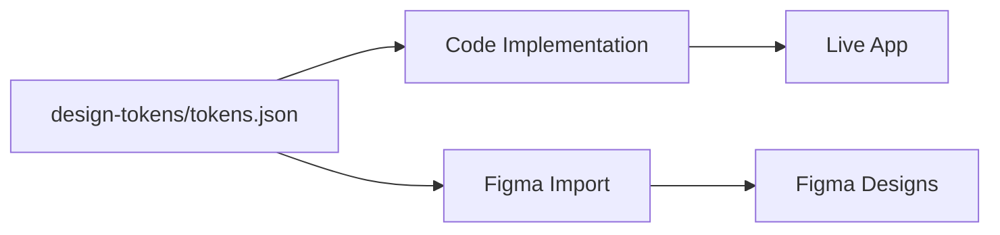
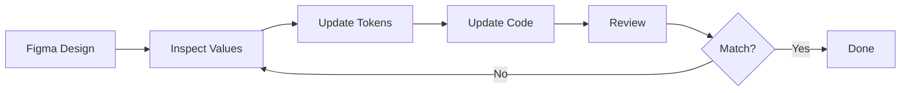
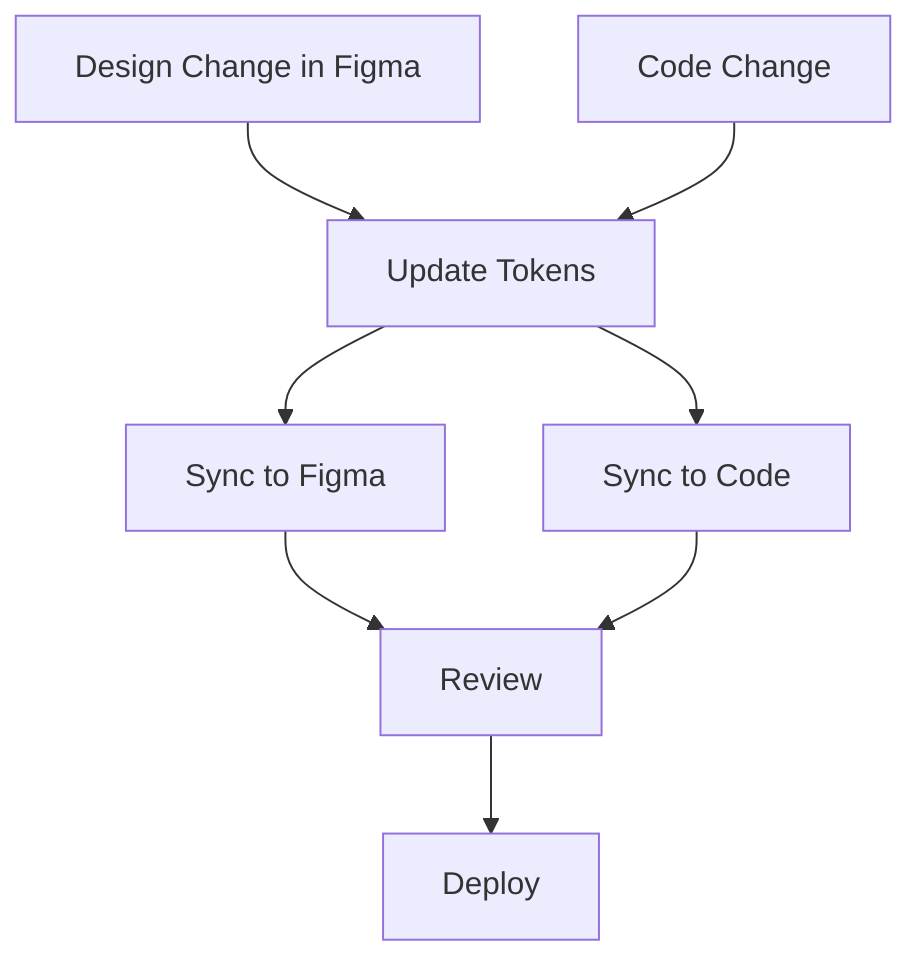

# Figma to Code Workflow - V14 Design System

Complete workflow for maintaining design synchronization between Figma and the codebase.

---

## 🎯 Workflow Overview

Since Figma Free doesn't have Dev Mode, we provide **three synchronization strategies**:

1. **Design Tokens as Source of Truth** (Recommended)
2. **Figma First, Code Second** (Design-driven)
3. **Bidirectional Sync** (Collaborative)

---

## Strategy 1: Design Tokens as Source of Truth (Recommended)

### Philosophy
The JSON design tokens are the single source of truth. Both Figma and code import from these tokens.

### Workflow



#### Step-by-Step Process

1. **Update Tokens**
   ```json
   // design-tokens/tokens.json
   {
     "color": {
       "brand": {
         "primary": {
           "value": "hsl(48, 100%, 50%)",
           "description": "Updated primary color"
         }
       }
     }
   }
   ```

2. **Export to Figma Format**
   ```bash
   # Update figma-tokens.json to match
   npm run export-figma-tokens  # (if automated)
   ```

3. **Import to Figma**
   - Open Figma
   - Plugins → Tokens Studio
   - Import updated `figma-tokens.json`

4. **Update Code**
   ```css
   /* src/index.css */
   :root {
     --brand-primary: 48 100% 50%;
   }
   ```

5. **Verify Sync**
   - Build app: `npm run dev`
   - Compare with Figma design
   - Adjust if needed

### Pros
✅ Single source of truth  
✅ Easy to version control  
✅ Automated exports possible  
✅ Consistent across platforms  

### Cons
❌ Requires discipline  
❌ Initial setup needed  

---

## Strategy 2: Figma First, Code Second

### Philosophy
Designers work in Figma first, developers extract values to code.

### Workflow



#### Step-by-Step Process

1. **Design in Figma**
   - Create components using Figma variables
   - Apply colors, spacing, typography
   - Maintain design system structure

2. **Extract Values**
   - Select elements in Figma
   - Note variable values or computed styles
   - Document in spreadsheet or notes

   Example extraction:
   ```
   Button Primary
   - Background: #FFCC00 (hsl(48, 100%, 50%))
   - Padding: 16px
   - Border Radius: 16px
   - Font Size: 14px
   - Font Weight: 600
   ```

3. **Update Design Tokens**
   ```json
   {
     "color": {
       "brand": {
         "primary": {
           "value": "hsl(48, 100%, 50%)"
         }
       }
     }
   }
   ```

4. **Update Code CSS**
   ```css
   :root {
     --brand-primary: 48 100% 50%;
   }
   ```

5. **Update Components**
   ```tsx
   <Button className="bg-brand-yellow p-atoms rounded-lg">
     Click me
   </Button>
   ```

6. **Visual Comparison**
   - Screenshot Figma design
   - Screenshot live implementation
   - Overlay and compare
   - Adjust differences

### Pros
✅ Designer-friendly  
✅ No plugin required  
✅ Full Figma feature access  

### Cons
❌ Manual extraction  
❌ Potential for errors  
❌ Time-consuming  

---

## Strategy 3: Bidirectional Sync

### Philosophy
Both Figma and code can be sources. Regular sync points maintain consistency.

### Workflow



#### Step-by-Step Process

1. **Weekly Sync Meetings**
   - Compare Figma and live app
   - Identify discrepancies
   - Decide on source of truth per item

2. **Document Changes**
   ```markdown
   ## Sync Session - 2025-01-15
   
   ### Figma → Code
   - Updated primary button shadow (deeper)
   - New spacing token: gap-extra-loose (32px)
   
   ### Code → Figma
   - Success green adjusted for accessibility
   - Added focus ring to inputs
   ```

3. **Update Both Platforms**
   - Figma: Update variables/components
   - Code: Update tokens and styles

4. **Verify**
   - Build and deploy preview
   - Share with design team
   - Get approval

### Pros
✅ Flexible  
✅ Handles real-world scenarios  
✅ Team collaboration  

### Cons
❌ Requires coordination  
❌ More complex  
❌ Potential conflicts  

---

## 🛠️ Tools & Utilities

### Browser Extension Method

**Use case:** Extract live implementation values to Figma

1. **Install CSSViewer** (Chrome/Firefox extension)
2. **Hover over elements** in live app
3. **Copy computed values**
4. **Apply to Figma components**

### Screenshot Overlay Method

**Use case:** Visual comparison Figma vs Live

1. **Take Figma screenshot** (Cmd/Ctrl + Shift + 4)
2. **Take live app screenshot** (same viewport)
3. **Use Photoshop/Figma** to overlay at 50% opacity
4. **Identify pixel differences**
5. **Adjust accordingly**

### Manual Token Export Script

Create a helper script to convert tokens:

```javascript
// scripts/export-figma-tokens.js
const tokens = require('../design-tokens/tokens.json');

// Convert HSL to HEX for Figma
function hslToHex(hsl) {
  // Conversion logic
  return hex;
}

// Generate Figma-compatible JSON
const figmaTokens = {
  colors: Object.entries(tokens.color).reduce((acc, [key, value]) => {
    acc[key] = {
      value: hslToHex(value.value),
      type: "color"
    };
    return acc;
  }, {})
};

// Write to figma-tokens.json
```

---

## 📋 Sync Checklist

Use this checklist for regular synchronization:

### Colors
- [ ] Brand colors match
- [ ] Accent colors match
- [ ] Neutral colors match
- [ ] Semantic colors (success/error) match
- [ ] Opacity values match

### Typography
- [ ] Font sizes match scale
- [ ] Line heights consistent
- [ ] Font weights available
- [ ] Letter spacing matches

### Spacing
- [ ] Component padding matches tokens
- [ ] Gap values consistent
- [ ] Margins follow system

### Components
- [ ] Buttons use correct tokens
- [ ] Cards use correct shadows
- [ ] Inputs use correct borders
- [ ] Icons use correct sizes

### Interactions
- [ ] Hover states match
- [ ] Active states match
- [ ] Focus states accessible
- [ ] Transitions smooth

---

## 🔄 Common Sync Scenarios

### Scenario 1: New Color Added in Figma

1. Designer adds new accent color in Figma
2. Extract HEX value
3. Convert to HSL
4. Add to `design-tokens/tokens.json`
5. Update `src/index.css`
6. Update `tailwind.config.ts`
7. Export updated `figma-tokens.json`

### Scenario 2: Spacing Change in Code

1. Developer updates padding token
2. Document change in PR
3. Notify design team
4. Designer updates Figma variables
5. Verify components in Figma
6. Confirm in code review

### Scenario 3: Component Redesign

1. Designer creates new component in Figma
2. Document token usage
3. Developer builds component in code
4. Compare visual output
5. Iterate until match
6. Update both Figma library and code

---

## 📊 Tracking Sync Status

Create a sync dashboard (spreadsheet or Notion):

| Element | Figma Status | Code Status | Sync Status | Notes |
|---------|--------------|-------------|-------------|-------|
| Primary Button | ✅ | ✅ | ✅ | Fully synced |
| Card Shadow | ⚠️ | ✅ | ⚠️ | Figma needs update |
| Typography Scale | ✅ | ✅ | ✅ | Fully synced |
| Success Color | ❌ | ✅ | ❌ | Accessibility fix needed |

Legend:
- ✅ Up to date
- ⚠️ Minor differences
- ❌ Out of sync

---

## 🎯 Best Practices

1. **Regular Sync Cadence**
   - Daily: Quick checks for active work
   - Weekly: Full design review
   - Monthly: Deep audit

2. **Version Control**
   - Tag design token versions
   - Match Figma file versions
   - Document in changelog

3. **Communication**
   - Slack/Teams channel for sync
   - Weekly design-dev meetings
   - Shared documentation

4. **Automation Where Possible**
   - CI/CD to deploy token updates
   - Scripts to generate Figma JSON
   - Automated visual regression tests

---

## 🚀 Quick Reference Commands

```bash
# Development
npm run dev              # Start local server
npm run build            # Build for production
npm run preview          # Preview production build

# Token Management
# (Add these scripts to package.json)
npm run export-tokens    # Export to Figma format
npm run validate-tokens  # Check token consistency
npm run audit-tokens     # Check code usage
```

---

## 📚 Additional Resources

- [Figma Variables Guide](https://help.figma.com/hc/en-us/articles/15339657135383)
- [Tokens Studio Plugin Docs](https://docs.tokens.studio/)
- [CSS Custom Properties MDN](https://developer.mozilla.org/en-US/docs/Web/CSS/--*)
- [V14 Design System Docs](./DESIGN_SYSTEM.md)

---

**Maintain sync, ship faster! 🚀**
